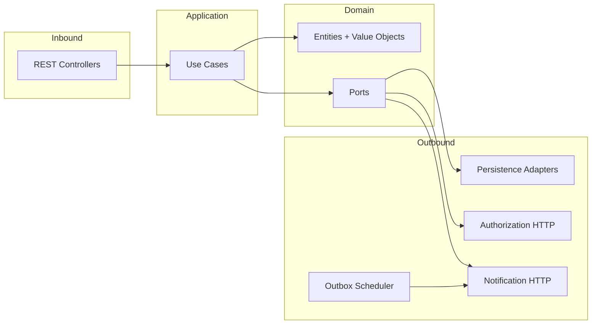
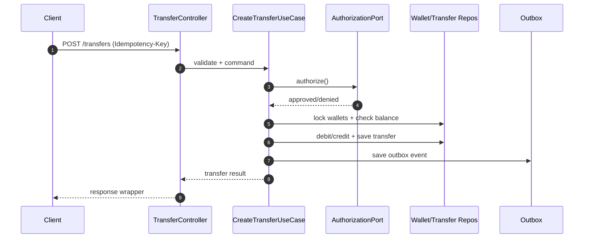

# Bank Service (Spring Boot 3 / Java 21)

Minimalist, backend for the Bank service using hexagonal architecture, strict idempotency, and concurrency‑safe transfers.

## Overview

A digital bank backend designed for safe transfers, even with retries and high concurrency.

What it does:

- Moves money between users safely (payer -> payee), keeping balances correct
- Prevents double transfers when clients retry the same request (requires `Idempotency-Key`)
- Handles many transfers happening at the same time without corrupting balances
- Applies key rules: payer must have funds, some user types can't pay, and an external authorization must approve

How it stays correct:

- Hexagonal architecture: domain rules live in the core; infrastructure (web, DB, external services) plugs in via ports/adapters
- Strict idempotency for transfers:
  - Same `Idempotency-Key` + same payload returns the original result
  - Same `Idempotency-Key` + different payload returns `409` (conflict)
- Concurrency-safe money movement:
  - Uses pessimistic row locks on both payer and payee wallets
  - Locks are acquired in deterministic order (lower userId first) to reduce deadlocks
- Transactional consistency:
  - Debit, credit, transfer record, and outbox event are persisted in a single DB transaction
  - If anything fails, the transaction rolls back and balances remain correct
- Outbox notifications:
  - External notifications are emitted from an outbox (best-effort, async)
  - Money movement never blocks on external calls

Concurrency deep dive: [docs/concurrency.md](docs/concurrency.md)

## Technologies and patterns

- Java 21 + Spring Boot 3
- Hexagonal architecture (domain first)
- Swagger/OpenAPI docs
- k6 integration tests with concise reports
- Docker + Compose with resource caps

## High‑Level Diagram



## Request Flow (Transfer)



## Quick Start

### Run the app (choose one)

#### Option A: Docker

```bash
docker compose up --build
```

#### Option B: Local (DB required)

```bash
docker compose up -d db
mvn spring-boot:run
```

### Integration tests (choose one, app must be running)

#### Option A: k6 via Docker

```bash
docker compose --profile k6 run k6 run /k6/smoke.js
```

#### Option B: k6 via local script

```bash
tests/scripts/run-k6.sh
```

Reports are stored in `tests/reports/`.

### Docs and Tools

- Swagger UI at `/swagger-ui.html`
- OpenAPI JSON at `/v3/api-docs`
- k6 test runner at `tests/scripts/run-k6.sh`

## Complementary Docs

- Manual testing: [docs/manual-testing.md](docs/manual-testing.md)
- Plan: [docs/plan.md](docs/plan.md)

## API

### Swagger

- UI: `http://localhost:8080/swagger-ui.html`
- JSON: `http://localhost:8080/v3/api-docs`

### Create User

`POST /users`

Headers:

- `Content-Type: application/json`

Body:

```json
{
  "fullName": "Example User",
  "document": "00000000000",
  "email": "user@example.com",
  "password": "secret",
  "type": "COMMON",
  "initialBalance": 1000.00
}
```

Response wrapper:

```json
{
  "success": true,
  "timestamp": "2026-01-31T12:34:56Z",
  "data": { "id": 1, "fullName": "Example User", "type": "COMMON", "balance": 1000.00 },
  "error": null
}
```

### Create Transfer

`POST /transfers`

Headers:

- `Idempotency-Key: <uuid>` (required)

Body:

```json
{
  "value": 10.00,
  "payer": 1,
  "payee": 2
}
```

Response wrapper:

```json
{
  "success": true,
  "timestamp": "2026-01-31T12:34:56Z",
  "data": { "id": 123, "status": "APPROVED", "createdAt": "2026-01-31T12:34:56Z" },
  "error": null
}
```
