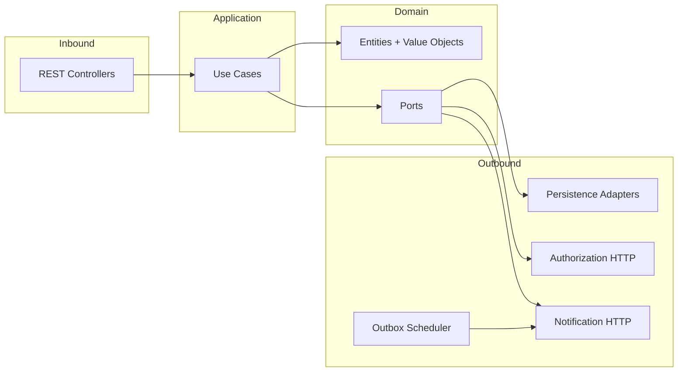
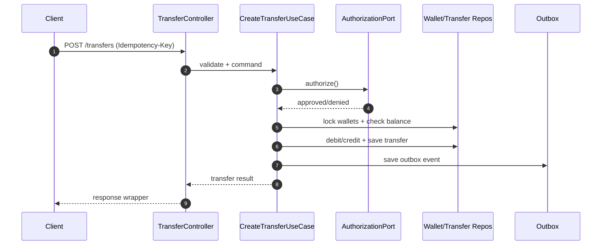

# Architecture Overview

This project follows hexagonal architecture to keep domain logic independent from infrastructure and frameworks.

## High‑Level Diagram

## Request Flow (Transfer)

## Key Design Decisions
- Domain rules live in application services, independent of web adapters
- Ports isolate all external dependencies (DB, HTTP services)
- Outbox prevents failed notifications from affecting transfer commits
