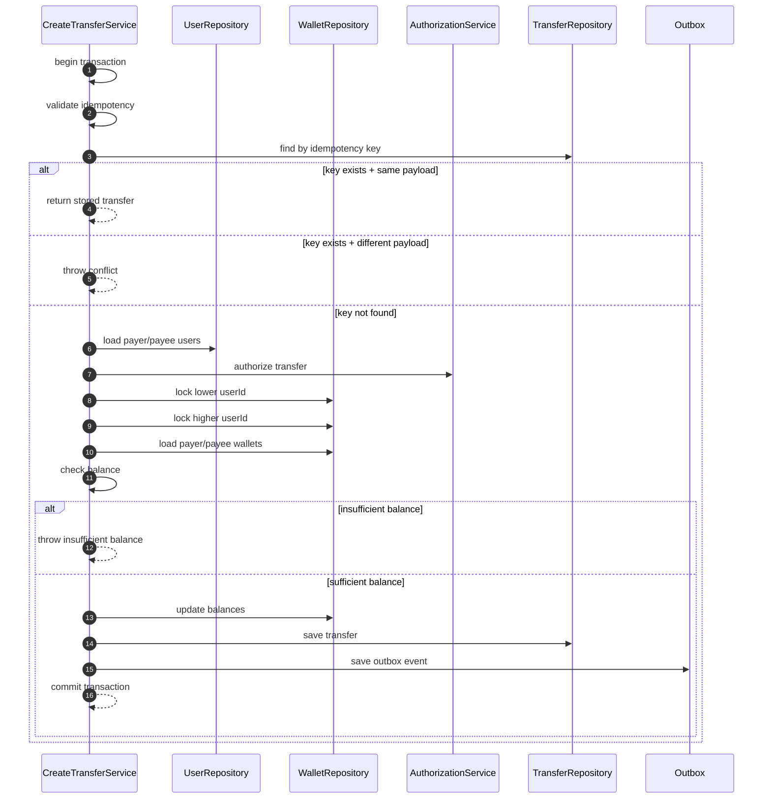
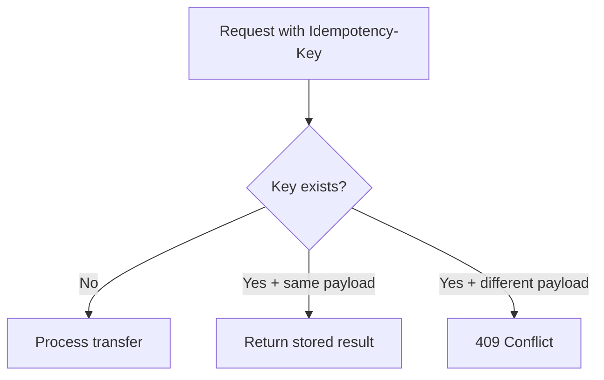

# Concurrency Safeguards (Deep Dive)

Transfers are the critical path. This design protects correctness under heavy load using a combination of:
- Required idempotency keys
- Pessimistic row locking on wallets
- Single ACID transaction for debit/credit + transfer + outbox
- Deterministic lock ordering to reduce deadlock risk

## Strategy Summary
1) **Idempotency required**: every transfer request carries `Idempotency-Key`.
2) **Pessimistic lock**: lock payer and payee wallet rows with `PESSIMISTIC_WRITE`.
3) **Single transaction**: all balance updates and transfer persistence happen atomically.
4) **Outbox**: notification is async and never blocks the money movement.

## Locking Diagram

## Why Pessimistic Locking
- Prevents **double-spend** when many transfers hit the same payer simultaneously.
- Ensures balance is checked against the most current committed state.
- Keeps logic simple and deterministic under stress.

## Idempotency Behavior
- If key already exists with **same payload**, return existing transfer result.
- If key exists with **different payload**, respond `409` conflict.

## Deadlock Avoidance
- Locks are acquired in **deterministic order** (lower userId first).
- This reduces lock inversion between concurrent transfers.

## Transaction Boundary
All of these steps are inside **one transaction**:
- Lock wallets
- Check payer balance
- Debit/credit
- Save transfer
- Save outbox event

If any step fails, the transaction rolls back and balances remain unchanged.

## Failure Scenarios
- **Authorization denied**: transaction starts but exits before locks; no balance changes
- **Insufficient balance**: transaction rolls back
- **Notification failure**: does not affect transfer; outbox can retry
